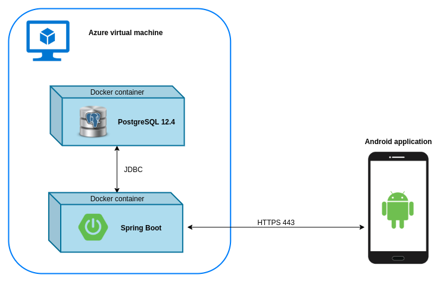

# **Vocabulary Builder**

## Introduction 

Vocabulary Builder is a full-stack project that consists of an Android application, a Spring Boot web application, and a PostgreSQL database. The back end runs in Docker containers and is hosted on an Azure virtual machine. The purpose of the project is to provide a tool for storing and reviewing vocabulary words. The project was developed between February and July, 2021. 

  

## Front End  

The front end of the project is a native Android application. Developed using Android Studio, it was written in Kotlin and has been tested using emulated Android devices (Pixel 2 API level 30, Pixel 4 API level 29, and Nexus 7 API level 28) as well as a physical device (Samsung Galaxy S8 API level 28). The application features both light and dark themes. 

  &nbsp;&nbsp;&nbsp;  &nbsp;&nbsp;&nbsp; 

 

### Functionality 

Users must have an internet connection and are required to log in before using the app. Once logged in, either with email and password or via a Google account, a user is shown their word list. Tapping on a word will display its definitions, if any are stored, and a delete icon to remove the word from the user’s word list.  

When adding a word to the list, it is not necessary to add its definition at the same time; users can view their undefined words and fill in the definitions at their convenience. To add a definition for a previously stored word, a user should navigate to the “Undefined” tab and tap on the word. This will display a popup that will allow the user to type in a definition. Alternatively, they can add the word to the list again from the “All” tab and supply a definition in the space provided. For any word, multiple distinct definitions may be provided; newer ones will be appended to the list, separated by a semicolon. The application will store neither duplicate words nor duplicate definitions. 

 

### Architecture 

The application uses Google’s recommended Android architecture: the Model-View-ViewModel. This architecture upholds the principle of separation of concerns. Each class has a specific, well-defined purpose and minimal dependencies on other classes.  

  
  
Source: https://developer.android.com/jetpack/guide

 

Many of the app’s components, most notably Room, LiveData, and RecyclerView, come from a collection of modern Android libraries known as Android Jetpack. 

Room is an abstraction layer over a SQLite database that is stored on the user’s device. Room is used to implement an offline cache for the application – words obtained from the network are stored locally so that if a user’s internet connection is lost after signing in, they are still able to see their words and toggle definition visibility. This makes for an improved user experience and a more efficient application that reduces the number of expensive network calls.  

LiveData is an observable data wrapper that is integrated into Room’s implementation, so when the database contents change, Room automatically updates LiveData to reflect the most recent values. LiveData itself is stored in and can be mutated by ViewModels; its value is displayed in Activities and Fragments with the help of RecyclerView, which provides an efficient way to display large lists of complex data.  

The repository manages the exchange of data between the application and the internet, and among the classes within the application. After asynchronously fetching a user’s words from the web server, it stores them in the offline cache. Retrofit makes fetching and decoding data from the web service easy by automatically running network calls on background threads and returning data as objects of a specified type. 

## Back End 

Comprising the back end is a Spring Boot web application and a PostgreSQL database. The web application provides access to an API that is secured using Firebase Authentication. Firebase is Google’s mobile development platform that offers a host of software packages to achieve common tasks. Communication with the API will happen using HTTPS requests.  

 

### Containers 

The back end is hosted on an Azure virtual machine, on which Docker is installed. Docker is a containerization tool that allows an application to run in its own isolated environment. A developer can create an image that defines the application’s environment and contains commands to set up and configure it. From an image, containers can be created. Easily configurable, these containers are the environments designed specifically for an application to run in. A major benefit of using Docker is portability; containers can be set up and torn down easily and at will. Developers can use their preferred operating system while collaborating on projects built for any platform. 

I use Docker Compose to host two containers: one for the database and one for the web application. I chose to use Docker because it facilitates the process of setting up and configuring PostgreSQL, and because it is a modern platform that is often used to develop microservices. 

 

### Database 

The database stores words and user associations in two tables, “vocabulary_words” and “users”. A one-to-many relationship exists between users and words. The database is UTF8 encoded, so users may store words in any language. 

An entry in the “vocabulary_words” table must contain an id, a word, and a user_id, and may contain zero, one, or multiple definitions separated by a semi-colon. Each vocabulary word is associated with exactly one user id. To maintain referential integrity, “user_id” is declared to be a foreign key referencing the “id” column of the “users” table. 

The “users” table stores basic user information. Aside from “id”, which is a value generated automatically by PostgreSQL, all the data in these columns is retrieved from Firebase after a user has registered. If a user is deleted from the table, any words that user has stored will be deleted from the “vocabulary_words” table. 

  

## Known Bugs 

- If a user does not log out of the application using the options menu “logout” item, the bottom navigation bar will show on the log in screen the next time the Android app is launched. 

- If a user tries to interact with the app after their authentication session has timed out, the app will crash and will need to be restarted. The user will need to log in again before they can use the app. 
